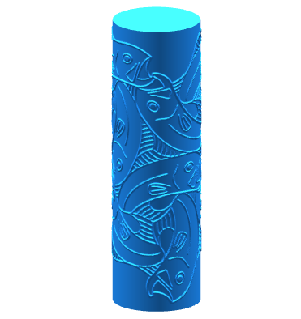

# Cookie Roller 🍪

This little tool will let you map an image (heightmap-style) onto a cylinder. Possible use cases include cookie making and general procrastination. Inspired by [a tweet](https://twitter.com/RobFathauerArt/status/1272954260586561536) by Robert Fathauer. 

[See it in action!](https://ondras.github.io/cookie-roller/)

